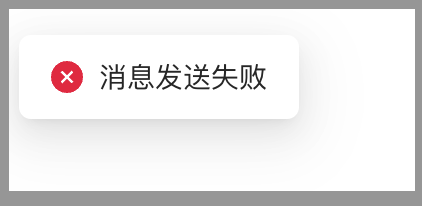

# GithubAction配置


## 持续集成
借用elog原来的流程图，我们从语雀发布后会触发**Hooks**，但是**hooks**并不支持直接调用**github action api**，所以我们需要借助第三方工具转发更新，好在[yuque-vitepress](https://github.com/elog-x/yuque-vitepress)提供了免费的[serverless](https://github.com/elog-x/serverless-api)。

强烈建议先看原来的[新手文档](https://github.com/elog-x/yuque-vitepress)，我只是补充部分内容，不适合新手！！

部署Vercel 部分比较简单，看文档就行。
## Workflows配置
仓库自带一个Workflows，仓库上方`Action`有个`Sync Docs`，具体配置文件在`./github/workflows/sync.yaml`，参数含义就不一一介绍了。


配置**Token**：[https://elog.1874.cool/notion/gvnxobqogetukays#github](https://elog.1874.cool/notion/gvnxobqogetukays#github)
如果出现下面错误，需要开启workflows权限，在**Setting**->**Action**->**Actions permissions**


自动化Action测试：[https://github.com/elog-x/serverless-api](https://github.com/elog-x/serverless-api)
## 墙
个别时候语雀推送并不会如期发生到上面那个免费的serverless-api，可以自己在语雀消息推送页面测试下，可能出现如下情况


可以选择自建一个服务，只需要接受到语雀发来更新请求，本地发送一个请求到githubAction（api接口没有墙），可以手动测试下，**token、user、repo**，这三个参数还是没变，自建服务网络上文档比较简单，就不详细说了。
```javascript
curl -X POST \
-H "User-Agent: @elog/serverless-api" \
-H "Accept: */*" \
-H "Authorization: token TOKEN" \
-d '{
"event_type": "deploy"
}' \
"https://api.github.com/repos/user/repo/dispatches"

```
